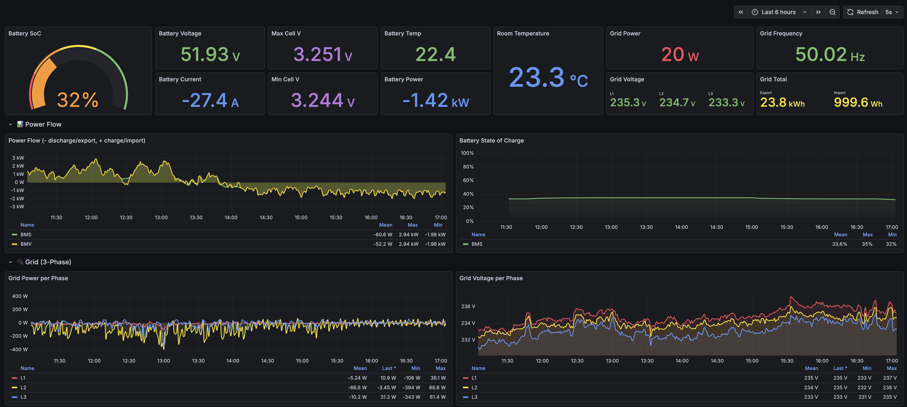
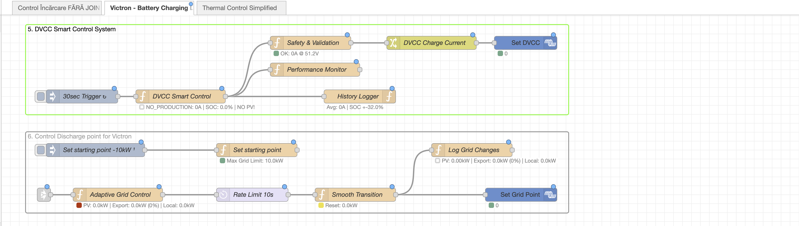

# Victron Energy Tools Collection

A collection of Node-RED flows and monitoring configurations for Victron Energy systems, focusing on battery management, thermal control, and data visualization.

## Projects

### [DVCC Smart Control System](./ekrano-node-red-charge-and-discharge-control/)
Node-RED flows for intelligent charge and discharge control of Victron battery systems.
- Dynamic grid setpoint control
- DVCC (Distributed Voltage and Current Control) automation
- Smart charge/discharge scheduling

### [Battery Thermal Control](./ekrano-node-red-thermal-control/)
Automated thermal management system for battery storage installations.
- Maintains optimal battery temperature (22.5-26.5°C)
- Tuya-based AC unit control
- Telegram alerts for critical conditions
- InfluxDB logging for historical analysis

### [MQTT to Grafana Stack](./mqtt-telegraf-influxdb-grafana/)
Complete monitoring pipeline for Victron data visualization.
- Telegraf configuration for MQTT data collection
- InfluxDB storage with organized measurements
- Grafana dashboard for real-time monitoring

## Requirements

- Victron Energy GX device (Cerbo GX, Venus GX, etc.)
- Node-RED (on GX device or separate host)
- InfluxDB 2.x
- Grafana (optional, for visualization)

## Quick Start

1. Clone this repository
2. Navigate to the project you need
3. Follow the README in each subfolder for specific setup instructions

## Screenshots

### Grafana Dashboard

### DVCC Control

### Thermal Control

## License

MIT License - Feel free to use and modify for your own installations.

## Author

**sm26449**
Email: sm26449@diysolar.ro

---

*Built for the Victron Energy + Node-RED community*
