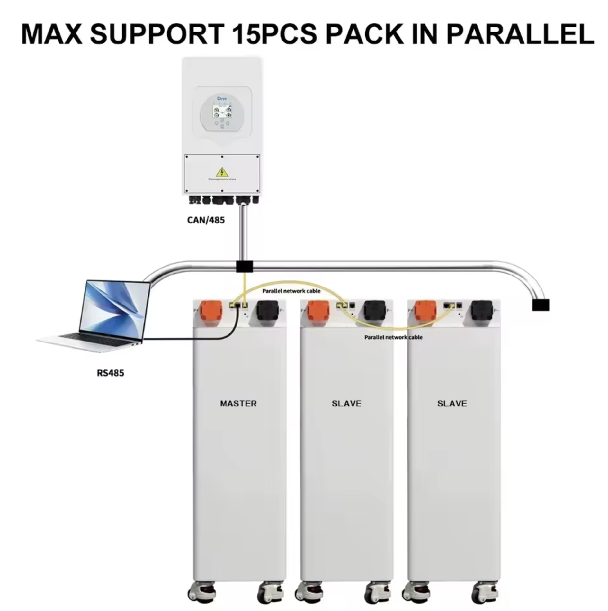

# Seplos BMS MQTT

**Seplos BMS V3 to MQTT/InfluxDB Bridge with Home Assistant Auto-Discovery**

An enhanced, modular Python application for monitoring Seplos BMS V3 batteries via RS485 Modbus RTU. Publishes data to MQTT with Home Assistant auto-discovery and optionally to InfluxDB for time-series storage.

> **Fork Info**: This project is a significantly enhanced fork of [Seplos3MQTT](https://github.com/ferelarg/Seplos3MQTT) with major refactoring, new features, and improved reliability.

## Features

### Core Features
- **RS485 Modbus RTU Snooper** - Passive listening on the RS485 bus (no active polling)
- **Multi-Battery Support** - Automatically detects and monitors up to 16 batteries
- **Home Assistant Auto-Discovery** - Batteries appear automatically in HA
- **Pack Aggregation** - Virtual "Pack" entity with totals/averages across all batteries

### New in v2.4
- **Modular Architecture** - Clean separation into reusable components
- **InfluxDB Integration** - Optional time-series database storage
- **MQTT Command Subscription** - On-demand value requests via `R/seplos/#` topic
- **Health Monitoring** - Periodic health checks with stale data detection
- **Smart Publish Modes** - `changed` (only on value change) or `all` (every update)
- **Automatic Reconnection** - MQTT and InfluxDB reconnect with exponential backoff
- **File Logging** - Optional log file output
- **Docker Ready** - Optimized Alpine-based container

### Data Published

For each battery:
- **Cell Voltages** (1-16) - Individual cell voltage readings
- **Temperature Sensors** (1-6) - Temperature readings from all sensors
- **Pack Voltage** - Total battery voltage
- **Current** - Charge/discharge current (positive = charging)
- **SOC** - State of Charge percentage
- **SOH** - State of Health percentage
- **Capacity** - Remaining and rated capacity
- **Cycle Count** - Battery charge cycles
- **Alarms** - Active alarm flags
- **Status** - Charging/Discharging/Standby

Pack Aggregate:
- **Total Voltage** - Sum of all battery voltages
- **Total Current** - Sum of all currents
- **Average SOC** - Average state of charge
- **Min/Max Values** - Lowest/highest cell voltages across all batteries
- **Batteries Online** - Count of active batteries

## Architecture

```
seplos/
├── __init__.py          # Package exports
├── config.py            # INI configuration loader
├── logging_setup.py     # Logging configuration
├── mqtt_manager.py      # MQTT connection & publishing
├── influxdb_manager.py  # InfluxDB integration
├── serial_snooper.py    # RS485 Modbus RTU parser
├── pack_aggregator.py   # Multi-battery aggregation
├── health_monitor.py    # Health checks & watchdog
└── utils.py             # Shared utilities
```

## Quick Start

### Prerequisites
- USB to RS485 adapter connected to Seplos BMS RS485 port
- MQTT Broker (e.g., Mosquitto)
- Docker (recommended) or Python 3.9+

### 1. Clone the Repository

```bash
git clone https://github.com/sm26449/seplos-bms-mqtt.git
cd seplos-bms-mqtt
```

### 2. Configure

Edit `seplos_bms_mqtt.ini`:

```ini
[general]
log_level = INFO
log_file =

[serial]
port = /dev/ttyUSB0
baudrate = 19200

[mqtt]
server = 192.168.1.100
port = 1883
username = seplos
password = your_password
prefix = seplos
publish_mode = changed

[influxdb]
enabled = false
url = http://localhost:8086
token = your-influxdb-token
org = your-org
bucket = seplos
write_interval = 5
publish_mode = changed

[health]
check_interval = 60
stale_timeout = 120
```

### 3. Build and Run with Docker

```bash
# Build the image
docker build -t seplos-bms-mqtt:v2.4 .

# Run standalone
docker run -d \
  --name seplos-bms-mqtt \
  --restart unless-stopped \
  --network=host \
  --device=/dev/ttyUSB0:/dev/ttyUSB0 \
  -v $(pwd)/seplos_bms_mqtt.ini:/app/seplos_bms_mqtt.ini \
  seplos-bms-mqtt:v2.4
```

### 4. Integration with PV-Stack (Portainer)

Add to your `docker-compose.pv-stack.yml`:

```yaml
  seplos-bms-mqtt:
    build:
      context: /path/to/seplos-bms-mqtt
      dockerfile: Dockerfile
    image: seplos-bms-mqtt:v2.4
    container_name: pv-stack-seplos
    restart: unless-stopped
    labels:
      - "com.docker.compose.project=pv-stack"
      - "io.portainer.accesscontrol.teams=pv-stack"
    network_mode: host
    devices:
      - /dev/ttyUSB0:/dev/ttyUSB0
    volumes:
      - ${DOCKER_ROOT}/pv-stack/seplos/config/seplos_bms_mqtt.ini:/app/seplos_bms_mqtt.ini
    depends_on:
      - mosquitto
      - influxdb
```

## Infrastructure Setup

### MQTT (Mosquitto) - Create User

```bash
# Enter the mosquitto container
docker exec -it pv-stack-mosquitto sh

# Create password file and add user
mosquitto_passwd -c /mosquitto/config/pwfile seplos
# Enter password when prompted

# Add to mosquitto.conf
cat >> /mosquitto/config/mosquitto.conf << 'EOF'
# Mosquitto Configuration
# Generated by Docker Services Manager

# Disable anonymous access (require authentication)
allow_anonymous false

# Standard MQTT listener
listener 1883

# WebSocket listener
listener 9001
protocol websockets

# Persistence settings
persistence true
persistence_file mosquitto.db
persistence_location /mosquitto/data/

# Password file for authentication
password_file /mosquitto/config/pwfile

# Logging
log_dest file /mosquitto/log/mosquitto.log
log_dest stdout
log_type error
log_type warning
log_type notice
log_type information

# Connection settings
max_connections -1
EOF

# Restart container
docker restart pv-stack-mosquitto
```

### InfluxDB - Create Bucket and Token

```bash
# Create organization (if not exists)
docker exec pv-stack-influxdb influx org create --name PV-Stack

# Create bucket for Seplos data
docker exec pv-stack-influxdb influx bucket create \
  --name seplos \
  --org PV-Stack \
  --retention 0

# Get bucket ID
BUCKET_ID=$(docker exec pv-stack-influxdb influx bucket list --org PV-Stack | grep seplos | awk '{print $1}')

# Create API token with read/write access
docker exec pv-stack-influxdb influx auth create \
  --org PV-Stack \
  --description "Seplos BMS MQTT token" \
  --read-bucket $BUCKET_ID \
  --write-bucket $BUCKET_ID

# Copy the token from output and add to seplos_bms_mqtt.ini
```

### Home Assistant Integration

Batteries will auto-discover via MQTT. Ensure your HA `configuration.yaml` has:

```yaml
mqtt:
  broker: 192.168.1.100
  port: 1883
  username: homeassistant
  password: your_ha_mqtt_password
  discovery: true
  discovery_prefix: homeassistant
```

## MQTT Topics

### Published Topics

```
seplos/battery_1/soc          # State of Charge
seplos/battery_1/voltage      # Pack voltage
seplos/battery_1/current      # Current (+ charging, - discharging)
seplos/battery_1/cell_1       # Cell 1 voltage
...
seplos/battery_1/cell_16      # Cell 16 voltage
seplos/battery_1/temp_1       # Temperature sensor 1
...
seplos/battery_1/state        # online/offline
seplos/pack/total_voltage     # Aggregate voltage
seplos/pack/total_current     # Aggregate current
seplos/pack/average_soc       # Average SOC
seplos/pack/batteries_online  # Count of online batteries
seplos/health/uptime          # Service uptime
seplos/health/mqtt_connected  # MQTT connection status
```

### Command Topics (On-Demand Requests)

When using `publish_mode = changed`, values only publish when they change. To request current values on-demand:

```bash
# Request single value
mosquitto_pub -t "R/seplos/battery_1/soc" -m ""

# Request all values for a battery
mosquitto_pub -t "R/seplos/battery_1/all" -m ""

# Request pack aggregate
mosquitto_pub -t "R/seplos/pack/all" -m ""
```

## Configuration Reference

### [general]
| Option | Default | Description |
|--------|---------|-------------|
| log_level | INFO | DEBUG, INFO, WARNING, ERROR |
| log_file | (empty) | Path to log file (empty = console only) |

### [serial]
| Option | Default | Description |
|--------|---------|-------------|
| port | /dev/ttyUSB0 | Serial port for RS485 adapter |
| baudrate | 19200 | Baud rate (19200 for Seplos V3) |

### [mqtt]
| Option | Default | Description |
|--------|---------|-------------|
| server | localhost | MQTT broker address |
| port | 1883 | MQTT broker port |
| username | (empty) | MQTT username |
| password | (empty) | MQTT password |
| prefix | seplos | Topic prefix |
| publish_mode | changed | `changed` or `all` |

### [influxdb]
| Option | Default | Description |
|--------|---------|-------------|
| enabled | false | Enable InfluxDB integration |
| url | http://localhost:8086 | InfluxDB URL |
| token | | API token |
| org | | Organization name |
| bucket | seplos | Bucket name |
| write_interval | 5 | Min seconds between writes |
| publish_mode | changed | `changed` or `all` |

### [health]
| Option | Default | Description |
|--------|---------|-------------|
| check_interval | 60 | Health check interval (0 = disable) |
| stale_timeout | 120 | Mark battery offline after N seconds |

## Hardware Wiring

### RS485 Pinout


### Wiring Diagram




Connect USB-RS485 adapter to any available RS485 port on the Seplos BMS. The software operates in snooper/passive mode, listening to communication between the BMS master and batteries.

## Troubleshooting

### No Data Received
1. Check serial port permissions: `sudo chmod 666 /dev/ttyUSB0`
2. Verify baud rate (19200 for Seplos V3)
3. Check RS485 wiring (A/B connections)
4. Enable DEBUG logging to see raw data

### MQTT Connection Issues
1. Verify broker is running: `docker logs pv-stack-mosquitto`
2. Test connection: `mosquitto_pub -h HOST -u USER -P PASS -t test -m "hello"`
3. Check firewall for port 1883

### InfluxDB Connection Issues
1. Verify token has read/write permissions
2. Check bucket exists in correct organization
3. Test with: `docker exec pv-stack-influxdb influx ping`

### Device Disconnected Error
```
device reports readiness to read but returned no data
```
This usually means another process is using the serial port. Check with:
```bash
lsof /dev/ttyUSB0
fuser /dev/ttyUSB0
```

## Release Notes

### v2.4 (Current)
- Added MQTT command subscription for on-demand value requests
- Added `mqtt_commands_received` health metric
- Fixed topic prefix duplication in republish handler

### v2.3
- Complete modular refactoring
- Added InfluxDB integration with reconnection
- Added Pack Aggregator for multi-battery systems
- Added Health Monitor with stale detection
- Added publish_mode support (changed/all)
- Added file logging support
- Improved MQTT reconnection with exponential backoff

### v1.0 (Original)
- Basic Seplos BMS V3 to MQTT bridge
- Home Assistant auto-discovery

## Credits

- **Original Project**: [Seplos3MQTT](https://github.com/ferelarg/Seplos3MQTT)
- **Enhanced Fork**: DIYSolar.ro

## License

MIT License - See [LICENSE](LICENSE) file.

## Contact

- **Email**: sm26449@diysolar.ro
- **Project**: https://github.com/sm26449/seplos-bms-mqtt

---

**Disclaimer**: THE SOFTWARE IS PROVIDED "AS IS", WITHOUT WARRANTY OF ANY KIND. Use at your own risk when working with battery systems.
